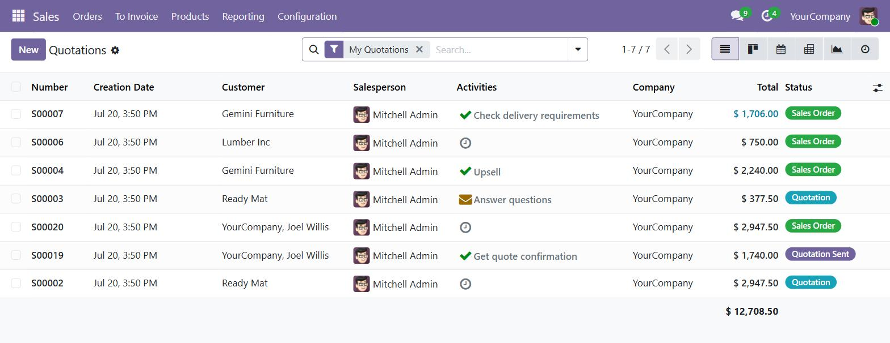
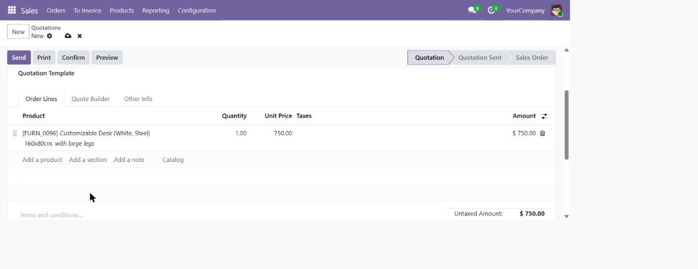
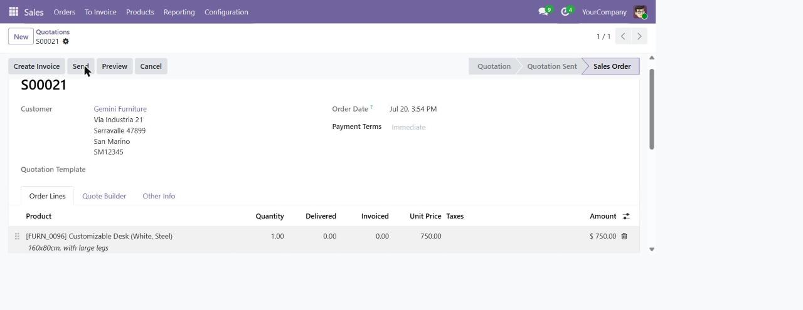
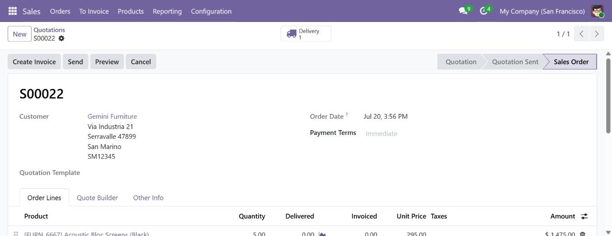
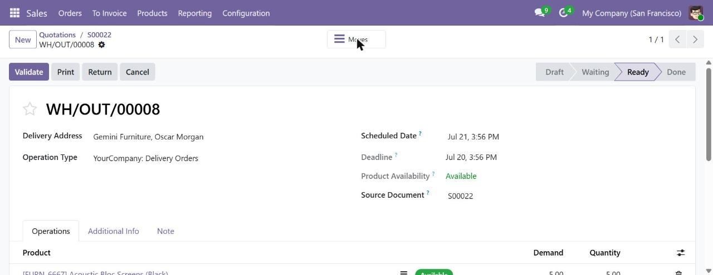
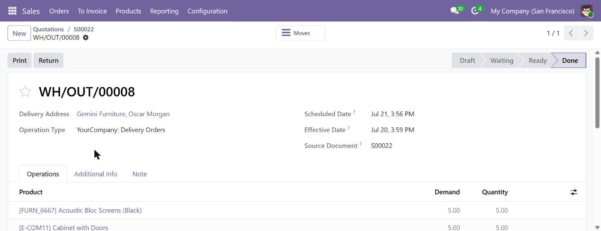
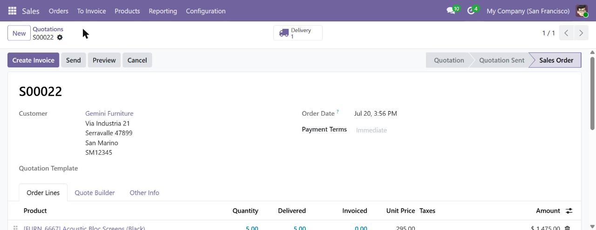
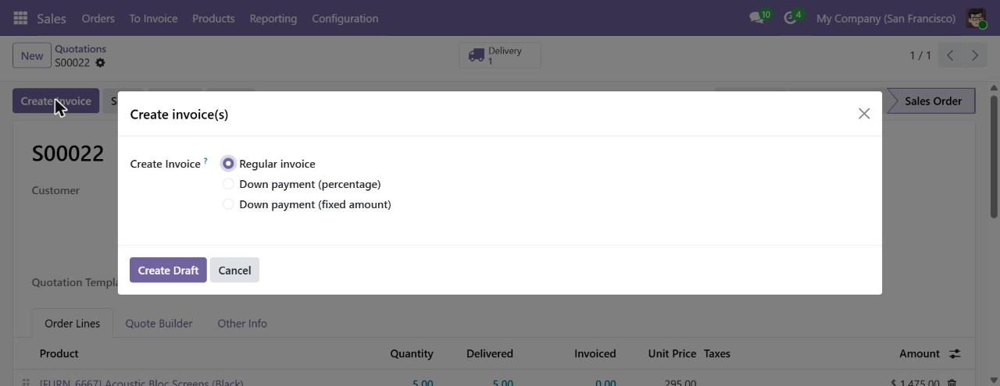
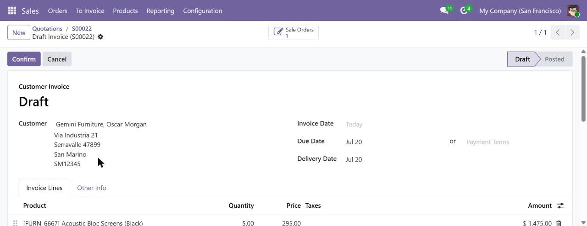
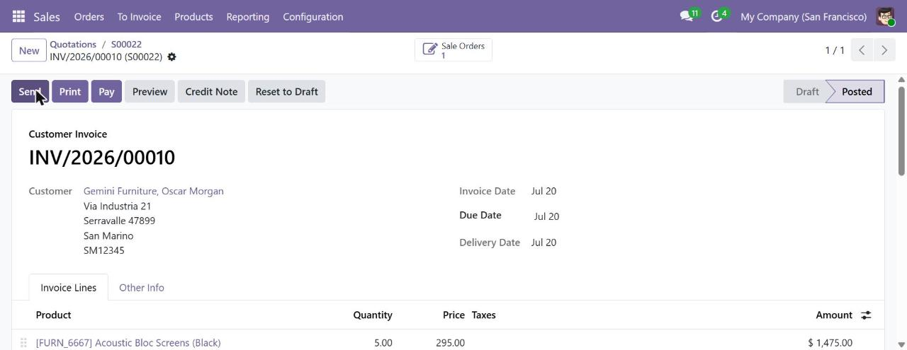

# Odoo Sales 模組 - 操作 SOP

> 版本標示：Odoo 19 CE（v19-ce-jenny demo 環境實測）
> 學習日期：2026-07-20
> 狀態：🔄 草稿
> 說明：每支影片核心操作步驟，[MM:SS] 為影片時間錨點；主線流程已於 demo 環境驗證並補截圖

---

## 主線流程驗證截圖（Odoo 19 CE 實測）

> 環境：`odoo-demo19.ideaxpress.biz` → 資料庫 `v19-ce-jenny`
> 模組：Sales + Inventory
> 測試日期：2026-07-20
> 流程：Quotation → Sales Order → Delivery → Invoice（Posted）

### Step 1｜Quotations 列表



路徑：Sales → Orders → Quotations
- 顯示各報價單狀態（Quotation / Quotation Sent / Sales Order）
- My Quotations 過濾器為預設視圖

---

### Step 2｜新建報價單（加入產品）



路徑：Quotations → New
- Customer：Gemini Furniture（地址自動帶入）
- Order Lines：加入 Customizable Desk (White, Steel)，數量 1，單價 $750
- 狀態欄顯示 **Quotation**

---

### Step 3｜確認報價單 → 銷售訂單



按 **Confirm** 後：
- 單號從 New 變為 **S00021**
- 狀態跳至 **Sales Order**
- Order Lines 新增 Delivered / Invoiced 欄位（初始值 0）

---

### Step 4｜銷售訂單顯示 Delivery 智慧按鈕



以 S00022（含實體產品的 demo SO）示範：
- 標題列右側出現卡車圖示 **Delivery 1**
- 說明：需安裝 Inventory 模組 + 產品類型為 Storable 才會產生交貨單

---

### Step 5｜出貨單（WH/OUT/XXXXX）- Ready 狀態



路徑：銷售訂單 → Delivery → WH/OUT/00008
- Delivery Address：客戶聯絡人
- Product Availability：**Available**（庫存足夠）
- Source Document：S00022（追溯來源 SO）
- 狀態：**Ready**，可執行 Validate

---

### Step 6｜出貨完成（Done）



按 **Validate** 後：
- 狀態從 Ready → **Done**
- Effective Date 自動填入（實際出貨日）
- 操作按鈕剩 Print / Return（不可再 Validate）

---

### Step 7｜回銷售訂單確認出貨數量



路徑：麵包屑返回 S00022
- Order Lines 的 **Delivered** 欄位更新為實際出貨數
- 此時 **Create Invoice** 按鈕可使用（依交付開票政策）

---

### Step 8｜建立發票對話框



按 **Create Invoice** 後彈出對話框：
- **Regular invoice**（預設）：開全額發票
- Down payment (percentage)：預付款百分比
- Down payment (fixed amount)：預付款固定金額
- 按 **Create Draft** 建立草稿

---

### Step 9｜草稿發票



Customer Invoice / **Draft** 狀態：
- Invoice Lines 自動帶入產品與數量
- Invoice Date / Due Date / Delivery Date 自動填入
- 可在此修改後按 **Confirm** 過帳

---

### Step 10｜發票過帳（Posted）



按 **Confirm** 後：
- 發票編號從 Draft 變為 **INV/2026/00010**
- 狀態：**Posted**（正式應收帳款）
- 可執行：Send / Print / **Pay** / Credit Note / Reset to Draft

---

## SAL01 — Invoice what is ordered（依訂購開票）
> 來源：Invoicing for what is ordered | https://www.youtube.com/watch?v=8QviDPrj39I
> 學習日期：2026-07-20
> 狀態：🔄 草稿

操作路徑：Sales → Configuration → Settings
1. [00:19] Quotations and Orders 區段：啟用 Online Signature、Online Payment。
2. [00:31] Shipping 區段：啟用 Delivery Methods（自動計算運費）。
3. [00:44] Invoicing 區段：選 Invoice what is ordered → Save。
4. [02:40] Sales → Orders → New，選客戶，設定 Expiration（如 30 天）與 Payment Terms（如 Immediate Payment）。
5. [04:05] Order lines 加產品；[04:12] Add shipping 選運送方式（費用成為明細行）。
6. [04:31] Preview → 客戶按 Sign and Pay → Accept and Sign → Pay，訂單即時確認。
7. [05:31] Create Invoice → Regular invoice（draft）→ Confirm。
8. [06:10] 回 Sales Order → Delivery 智慧按鈕 → Validate。

---

## SAL02 — Invoice what is delivered（依交付開票）
> 來源：Invoicing for what is delivered | https://www.youtube.com/watch?v=JpqZFT7RLaw
> 學習日期：2026-07-20
> 狀態：🔄 草稿

操作路徑：Sales → Configuration → Settings → Invoicing
1. [01:09] Invoicing 區段選 Invoice what is delivered → Save（新產品預設此政策）。
2. [01:31] Sales → Orders → Quotations → New，選客戶。
3. [02:06] Payment Terms → Search more → 選 2/7 net 30（7 天內付款享 2% 折扣，否則 30 天到期）。
4. [02:32] 加產品；若庫存不足（紅字），因依交付開票不需等補貨。
5. [03:02] Confirm → Delivery 智慧按鈕 → Validate → Create Back Order（保留欠交數量）。
6. [03:44] Create Invoice → Regular（僅開已交付數量）→ Confirm → Pay（2% 折扣自動套用）→ Create Payment。
7. 處理 back order：回 Delivery，Validate 剩餘數量 → 再 Create Invoice（僅剩餘數量）。

---

## SAL03 — Selling products（銷售產品總覽）
> 來源：Selling products | https://www.youtube.com/watch?v=uPMpMH1A6vk
> 學習日期：2026-07-20
> 狀態：🔄 草稿

操作路徑：Sales → Configuration → Settings；Sales → Products → Products
1. [00:46] Settings：Product Catalog 啟用 Variants、Units of Measure、Packagings；Pricing 啟用 Pricelists、Discounts → Save。
2. [01:39] 產品 Product Type = Goods；Invoicing Policy = Ordered quantities；啟用 Track Inventory（出現 Forecasting/Reordering 智慧按鈕）。
3. [02:57] Attributes and Variants 分頁：設定 fabric/color/size，自動生成 12 種組合。
4. [03:28] Prices 分頁：設定價格規則（如 US retailer 滿 5 件 20% off）。
5. [04:03] Accounting：設定 Income/Expense account（連結 furniture sales account）。
6. [04:51] Throw pillow → Sales 分頁 → Upsell/Cross-sell：設定 Packagings（pack of 3）、Optional/Accessory/Alternative products。
7. [06:30] 服務產品：Product Type = Service，Create on order（task/project/nothing）、Invoicing Policy（based on timesheets）、Plan Services。
8. [08:14] 產品 Sales → eCommerce Shop → 發布 Publish 上架。

---

## SAL04 — Create your First Sales Quotation
> 來源：Create your First Sales Quotation | https://www.youtube.com/watch?v=kK7IBFi8FEE
> 學習日期：2026-07-20
> 狀態：🔄 草稿

操作路徑：Sales → Orders → Quotations → New
1. [00:44] Settings：Pricing 啟用 Discounts、Promotions/Loyalty/Gift Cards；Quotations 啟用 Quotation Templates → Save。
2. [01:18] Orders → Quotations → New，選客戶（地址/價目表自動帶入）。
3. [02:36] Add a product（有變體則跳窗選材質/顏色/包裝）。
4. [03:13] Catalog 按鈕批次加產品 → Back to quotation。
5. [04:18] Add section（如 Furniture / Services）用拖曳排序；設定圖示可增減欄位。
6. [05:19] Add shipping 選 Standard delivery；用 Discount 按鈕（10% all order lines → Apply）。
7. [06:25] Quote Builder 分頁加 PDF 頁首/頁尾。
8. [06:47] Preview → 客戶入口可 Sign and Pay、Feedback、Reject（附訊息，記錄於 chatter，狀態轉 Cancelled）。
9. [08:43] Set to quotation → Send by email → Send → Confirm 轉銷售訂單。

---

## SAL05 — Adding headers and footers to quote templates
> 來源：Adding headers and footers to quote templates | https://www.youtube.com/watch?v=pJ7YgbYToD0
> 學習日期：2026-07-20
> 狀態：🔄 草稿

操作路徑：Sales → Configuration → Settings；Products → Product Variants
1. [00:41] Settings：啟用 Variants、Quotation Templates、PDF Quote Builder → Save。
2. [01:23] Products → Product Variants → 選特定變體（Wi-Fi 黑色）→ Documents 智慧按鈕 → Upload PDF。
3. [02:01] 卡片 ⋯ → Edit → Sales 區「Sale visible at」= Inside quote PDF。
4. [02:55] 父產品 Documents → 卡片 toggle「Publish on website」（e-commerce 區勾選）→ 產品頁可下載。
5. [04:24] Configuration → Quotation Templates → 選範本 → Quote Builder 分頁 → Add headers and footers → 選 header 與 footer 檔 → Select。
6. [05:33] Orders → Quotations → New，套用範本（自動帶入產品），Quote Builder 分頁選 header/product/footer PDF → Send。

---

## SAL06 — Sales Basics
> 來源：Sales Basics | https://www.youtube.com/watch?v=IwvVR2H7gvE
> 學習日期：2026-07-20
> 狀態：🔄 草稿

操作路徑：Sales（介面導覽）
1. [00:40] Dashboard 預設 filter 僅顯示當前使用者報價，移除 filter 看全部；右側可切換檢視。
2. [01:01] Configuration → Settings：Product Catalog / Pricing / Quotations and Orders 等設定。
3. [01:26] Reporting 選單：多種分析頁面。
4. [01:43] Products → Products；亦有 Product Variants、Pricelists、Discount & Loyalty、Gift Cards & eWallet。
5. [02:19] To Invoice → Orders to Invoice / Orders to Upsell。
6. [02:31] Orders 選單 → Quotations / Orders / Sales Teams / Customers。

---

## SAL07 — Your First Quotation
> 來源：Your First Quotation | https://www.youtube.com/watch?v=Q0MKrE5YfnQ
> 學習日期：2026-07-20
> 狀態：🔄 草稿

操作路徑：Sales → Orders → Quotations → New
1. [00:28] New 建立空白報價，加客戶（地址/價目表自動帶入）。
2. [00:57] 選 Quotation Template、Expiration、Recurring plan（訂閱）、Pricelist、Payment Terms。
3. [01:45] Order lines → Add a product（變體跳窗選色/數量）→ Confirm；或 Catalog 按鈕。
4. [02:47] Add section（Office furniture）、Add a note，拖曳排序。
5. [03:47] 明細下方按鈕：coupon code、reward、discount、shipping。
6. [03:47] Optional Products 分頁加互補品（office chair）。
7. [04:17] Quotation Builder 分頁加 header/product documents。
8. [04:51] Other Info 分頁（sales/invoicing/delivery 欄位）、Notes 分頁（內部備註，客戶看不到）。
9. [05:17] Preview 客戶入口 → Back to edit mode。
10. [05:44] Send by email → Send（狀態轉 Quotation Sent）→ Confirm 轉銷售訂單。

---

## SAL08 — Create Products
> 來源：Create Products | https://www.youtube.com/watch?v=LvGCY5rXISg
> 學習日期：2026-07-20
> 狀態：🔄 草稿

操作路徑：Sales → Products → Products → New
1. [00:33] 輸入產品名；上傳圖片（鉛筆圖示）。
2. [00:56] 勾選框：Can be Sold、Can be Purchased、Subscriptions。
3. [01:16] Product Type = Goods/Service。若 Service 出現 Create on order（nothing/task/project）、Invoicing Policy（prepaid/milestones/delivered）、Plan Services。
4. [03:16] 切回 Goods，勾 Track Inventory（可選 quantity/lots/serial）。
5. [03:57] Invoicing Policy = Ordered/Delivered quantities。
6. [04:13] 右側財務欄位：Sales Price、Sales Tax（預設 15%）、Category（Internal category）、Reference（SKU/barcode）、Company（多公司）、內部備註。
7. [05:32] Attributes and Variants 分頁：Add a line 設 color=red。
8. [05:53] Sales 分頁 Upsell/Cross-sell：Optional / Accessories / Alternative products。
9. [06:44] e-commerce：網站、分類、缺貨續售、顯示庫存、缺貨訊息、tags、媒體。
10. [07:37] Inventory 分頁（route/weight/volume）；Accounting 分頁（income/expense account）。
11. [08:30] Go to website 智慧按鈕（紅=未發布）→ 切 Publish。

---

## SAL09 — Create Product Variants
> 來源：Create Product Variants | https://www.youtube.com/watch?v=_XMyu9EKnPo
> 學習日期：2026-07-20
> 狀態：🔄 草稿

操作路徑：Sales → Configuration → Attributes
1. [00:31] Settings 啟用 Variants → Save。
2. [00:50] Configuration → Attributes → New。
3. [02:08] 命名 Attribute（material）；選 Display Type（radio/pills/select/color/multi checkbox）。
4. [02:57] Variants Creation Mode（instantly/dynamically/never，用後不可改）；e-commerce Filter Visibility（visible/hidden）。
5. [03:45] Attribute Values 加 line（cotton/fleece/polyester）；可勾 Free text；Default Extra Price（如 fleece +10、polyester +5）。
6. [05:23] Products → 選產品 → Attributes and Variants 分頁 → Add a line 選 material 與 values → Save。
7. [06:15] Variants 智慧按鈕 → 進各變體改照片（鉛筆圖示上傳）。
8. [07:16] Go to website 檢視變體與加價顯示。

---

## SAL10 — Quotation Templates
> 來源：Quotation Templates | https://www.youtube.com/watch?v=MBrOVjjfdJw
> 學習日期：2026-07-20
> 狀態：🔄 草稿

操作路徑：Sales → Configuration → Quotation Templates → New
1. [00:47] Settings 啟用 Quotation Templates → Save。
2. [01:57] Configuration → Quotation Templates → New。
3. [02:04] 命名（Four Person Desk Combo）；Quotation Validity（如 30 天，0=永久有效）。
4. [02:56] Confirmation Mail（Sales Order Confirmation）；Company（多公司）；Invoicing Journal（Customer Invoices）；Quote Calculator（可空白）。
5. [04:28] 勾 Online Signature、Online Payment（設預付百分比如 50%）。
6. [05:24] Lines 分頁加產品（four-person desk、4× office chair）。
7. [05:57] Optional Products 分頁加建議品（cable management box、furniture assembly）。
8. [06:28] Terms and Conditions 分頁貼條款；Quote Builder 分頁加頁首/頁尾。
9. [07:20] 使用：Orders → Quotations → New → 選 Quotation Template 自動帶入產品/條款/到期日；Preview → Sign and Pay → 付 50% → 轉銷售訂單。

---

## SAL11 — PDF Quote Builder
> 來源：PDF Quote Builder | https://www.youtube.com/watch?v=SIvlo2JFU_U
> 學習日期：2026-07-20
> 狀態：🔄 草稿

操作路徑：Sales → Configuration → Headers and Footers
1. [01:13] Settings：Quotations and Orders 啟用 PDF Quote Builder → Save。
2. [01:41] Configuration → Headers and Footers（顯示已上傳 PDF 元件）。
3. [02:05] 用第三方 PDF 工具（Adobe/Scribus）製作含動態文字欄位的 PDF；欄位命名用小寫+底線對應 Odoo 技術名。
4. [04:43] 找技術欄位名：Odoo 需在 Developer mode → Orders → Quotations → 選訂單 → hover 欄位問號 → 第二列 Field（如 expiration=validity_date）。
5. [05:43] PDF 工具 File → Export → Save as PDF（忽略錯誤）→ Save。
6. [06:10] Odoo Headers and Footers → Upload → 開檔 → Configure Dynamic Fields（Form Field Name 對應 Path）。
7. [07:19] PDF 表單頁可設 Document type、加入 Quotation Templates、指定公司。
8. [08:18] Orders → Quotations → New → 選範本 → Quote Builder 分頁選 header/about us/testimonials → Send by email。

---

## SAL12 — Product Documents
> 來源：Product Documents | https://www.youtube.com/watch?v=dhlNDmD3l-o
> 學習日期：2026-07-20
> 狀態：🔄 草稿

操作路徑：Sales → Products → 產品 → Documents 智慧按鈕
1. [00:43] Sales dashboard → New 建報價，選客戶，加產品（acoustic block screens）。
2. [01:21] 明細產品文字 → 內部連結箭頭 → 產品表 → Documents 智慧按鈕。
3. [01:48] New 建文件：Type（File/URL）、可設 Dynamic Fields。
4. [02:32] Sales 「visible at」：hidden / on quote / on confirmed order / inside quote PDF；e-commerce「Publish on website」勾選框。
5. [03:12] 快速法：Upload → 選 PDF → 卡片設 Inside quote PDF + toggle Publish on website。
6. [03:49] 回報價 → Quote Builder 分頁選文件 → Send by email（chatter 出現 PDF）。
7. [05:04] 產品頁 Go to website 可見下載連結。

---

## SAL13 — Online Quotation
> 來源：Online Quotation | https://www.youtube.com/watch?v=SNsRDT9qB34
> 學習日期：2026-07-20
> 狀態：🔄 草稿

操作路徑：Sales → Configuration → Quotation Templates
1. [01:48] Settings 啟用 Online Signature、Online Payment、Quotation Templates、Quotation Builder → Save（Quotation Builder 需 Website app，Odoo 會自動安裝）。
2. [02:40] Configuration → Quotation Templates → New，命名（Conference Room Table）。
3. [03:16] 設到期天數（0）、Online Confirmation（簽名+付款）、Confirmation Email（可空）、Company。
4. [04:29] Lines 分頁加產品（large meeting table）；Optional Products 分頁加建議品（勿過多）。
5. [05:52] Design Template 按鈕 → 進 Website 建置器 → Edit → 拖曳 Cover 區塊、改文字/圖片 → Save。
6. [07:50] Sales dashboard → New → 選客戶 → Quotation Template（自動帶入）→ Send by email → Send。
7. [09:05] Customer Preview 智慧按鈕 → 客戶可加選配品、調數量、Sign and Pay → 選付款方式 → Pay。

---

## SAL14 — Invoicing Policies
> 來源：Invoicing Policies | https://www.youtube.com/watch?v=Nk3Ro_2vqP4
> 學習日期：2026-07-20
> 狀態：🔄 草稿

操作路徑：Sales → Configuration → Settings → Invoicing
1. [02:38] Invoicing 區段：Invoicing Policy = Invoice what is ordered/delivered（僅影響新產品預設，不改既有產品）。
2. [03:28] 啟用 Automatic Invoice（線上付款確認即自動開票，但不自動寄送）；Down Payment 設定。
3. [04:12] Products → New → Product Type = storable → Invoicing Policy（ordered/delivered，可於產品表個別改）。
4. [06:13] Service 產品：Invoicing Policy 多出 prepaid/fixed price、based on delivered quantities、based on milestones、based on timesheets。
5. [06:56] delivered quantities（服務）：確認訂單後手動於 Delivered 欄輸入數量（用 options 選單開欄）→ Create Invoice。
6. [08:31] milestones：需安裝 Project app 並啟用 Milestones 功能，交付數量依專案里程碑自動更新。
7. [09:09] timesheets：需安裝 Timesheets app 並於 Project 設定啟用。

---

## SAL15 — Pipeline Management for B2B
> 來源：Pipeline Management for B2B | https://www.youtube.com/watch?v=8V2DXRZH9qo
> 學習日期：2026-07-20
> 狀態：🔄 草稿

操作路徑：Website → CRM → Sales → Inventory → Accounting
1. [01:27] Website Edit → 點 Submit 按鈕 → Form 區確認 Action = Create an opportunity，可指派 sales team/salesperson → Save。
2. [02:25] 客戶端填表單（姓名/電話/email/公司/主旨/問題）→ Submit。
3. [03:12] CRM → Leads → 找新商機 → 設優先度（星）→ Convert to Opportunity → 指派業務 → Create Customer → Create Opportunity。
4. [04:05] 更新 Expected Revenue（如 15,000）→ New Quotation 按鈕。
5. [04:32] Sales 加產品（5× factoring machine，庫存整合顯示可用量）→ Quote Builder 選 about us + product documents → Send by email → Send。
6. [05:47] 回商機 breadcrumbs → 移至 Proposition 階段 → Schedule Activity（follow-up quote，指派+到期日）。
7. [06:49] 客戶加倍訂單 → Activity Done + 留言 → 更新 Expected Revenue（30,000）→ Quotation 智慧按鈕改數量 10。
8. [07:30] Confirm 轉銷售訂單 → Delivery 智慧按鈕 → Validate → Create Invoice → Create Draft → Confirm → Pay → Create Payment。
9. [08:43] 回商機 → 按 Won 贏單。

---

## SAL16 — Promotion Basics & Discounts
> 來源：Promotion Basics & Discounts | https://www.youtube.com/watch?v=RdniKQlnxTQ
> 學習日期：2026-07-20
> 狀態：🔄 草稿

操作路徑：Sales → Products → Discounts and Loyalty
1. [01:11] Settings：Pricing 啟用 Discounts, Loyalty and Gift Card → Save。
2. [01:41] Products → Discounts and Loyalty → New。
3. [01:57] 命名（15 off orders）；Program Type 選項：Coupons / Next Order Coupons / Loyalty Cards / Promotions / Discount Code / Buy X Get Y。此例選 Discount Code。
4. [03:48] Validity（到期日，空=永久）；限用次數（如 420）；Company；Available on（Sales/Website/POS，Website 需勾才能於網站用）。
5. [05:33] Rules and Rewards → Conditional Rules → 設 discount code（odoopsy15）、滿額 100（tax excluded）、指定產品/類別（空=全部）→ Save & Close。
6. [07:10] Rewards → Reward Type（discount/free product/free shipping）、Reward（on order/specific products/cheapest product，如 100% on cheapest=最便宜免費）、Max discount、描述 → Save & Close → Save。
7. [09:24] 網站購物車輸入 discount code 套用 15% 折扣。

---

## SAL17 — Coupons
> 來源：Coupons | https://www.youtube.com/watch?v=KW5cZHg10jQ
> 學習日期：2026-07-20
> 狀態：🔄 草稿

操作路徑：Sales → Products → Discounts and Loyalty → New
1. [01:07] Settings 啟用 Discounts, Loyalty and Gift Card → Save。
2. [01:57] New → Program Type = Coupons，命名（20% discount）。
3. [02:55] Rules and Rewards → Conditional Rules → Add → 設最低數量 2（或滿額/指定產品/類別/tag，空=不限）→ Save & Close。
4. [03:44] Reward → 改 discount 20% on order（描述自動更新）→ Save & Close。
5. [04:27] Generate Coupons → 選 Anonymous customers（設數量）或 Selected customers（指定客戶/tags，空=全部客戶）→ 可設到期日 → Generate and Send（自動 email）。
6. [06:03] Coupon 智慧按鈕檢視已產生優惠券。
7. [06:46] 客戶購物車輸入 code 套用（任何人皆可用，非綁定客戶）。

---

## SAL18 — Loyalty Programs
> 來源：Loyalty Programs | https://www.youtube.com/watch?v=CymB_sD11bI
> 學習日期：2026-07-20
> 狀態：🔄 草稿

操作路徑：Sales → Products → Discounts and Loyalty
1. [00:56] Settings 啟用 Promotions, Loyalty and Gift Card → Save。
2. [01:44] Products → Discounts and Loyalty → 選/建 Loyalty Cards 方案（stealthy points）。
3. [02:00] Program Type = Loyalty Cards；Currency；Points Unit（自訂點數名）。
4. [02:50] Rules and Rewards → Conditional Rules（最低數量 1、最低金額 0=任何購買皆賺點）；客戶須有帳號才能集點。
5. [04:16] Add 新規則 → 指定特定產品（acoustic block screens 兩變體）→ Points（per order/per dollar/per unit，如 4.2）→ Save & Close。
6. [05:51] Rewards → discount/free product；設 discount 10%（on order/cheapest/specific）、兌換所需點數（100）、描述、Max discount → Save。
7. [07:41] Loyalty Cards 智慧按鈕看客戶點數。
8. [08:18] 使用：Orders → New → 選客戶加產品 → Reward 按鈕自動加折扣行 → Send by email。

---

## SAL19 — Gift Card Programs
> 來源：Gift Card Programs | https://www.youtube.com/watch?v=zjUHM0TSKZ0
> 學習日期：2026-07-20
> 狀態：🔄 草稿

操作路徑：Sales → Products → Gift Cards and eWallet
1. [00:52] Settings 啟用 Promotions, Loyalty and Gift Card → Save。
2. [01:12] Products → Gift Cards and eWallet（Program Type 欄可辨識，Items 欄看已產生數量）。
3. [01:55] New → 命名（60 off with Alpine table）；Program Type = Gift Card（預設）。
4. [02:26] Gift Card Products（預設 gift card）；Email Template（可預覽）；Print Report（僅 POS 安裝時，設 gift card）。
5. [03:39] Currency、Company、Available on（Website/POS）。
6. [04:07] Generate Gift Cards → Anonymous（設數量 100、面額 60）或 Selected customers；Valid until（3 個月）；描述 → Generate。
7. [05:37] Gift Card 智慧按鈕 → 清單 → Send（輸入客戶）→ Send。
8. [06:30] 客戶購物車 gift card or discount code 欄貼碼 → Apply。

---

## SAL20 — Sales Tax Part 1
> 來源：Sales Tax: Part 1 | https://www.youtube.com/watch?v=d97m_ns40qU
> 學習日期：2026-07-20
> 狀態：🔄 草稿

操作路徑：Apps；Accounting → Configuration → Taxes
1. [00:15] 建資料庫時 Odoo 依國別自動安裝 tax localization package（含 fiscal positions）。
2. [02:01] Apps app → 移除預設 filter → 搜 "tax" → 可裝 Avatax、Account Tax Cloud、Define Taxes as Python Code。
3. [02:49] Accounting → Configuration → Taxes（發票 app 亦有）。
4. [03:29] 開稅表：Tax Name、Tax Computation：Group of Taxes / Fixed / Percentage of Price / Percentage of Price Tax Included / Python Code。
5. [04:48] Percentage of Price：$100 × 15% = $15，總 $115。
6. [05:21] Percentage of Price Tax Included：含稅反推，簡易法 = 售價 ÷ (1 − 稅率)，稅額約 $17.65。

---

## SAL21 — Sales Tax Part 2
> 來源：Sales Tax: Part 2 | https://www.youtube.com/watch?v=gNuXCNm3kH0
> 學習日期：2026-07-20
> 狀態：🔄 草稿

操作路徑：Accounting → Configuration → Taxes / Fiscal Positions
1. [00:18] Tax Type（Sales/Purchase/None）決定用於哪些單據；Tax Scope（Goods/Services/空=不限）；Amount。
2. [01:41] Definition 分頁：Distribution for invoices/refunds，須有 1 條 base + 至少 1 條 tax 百分比行，設 Account 與 Tax Grids（自動產稅報）。
3. [03:15] Advanced Options：Label on Invoices、Tax Group、Country/Company、Include in Price、Affect base of subsequent taxes。
4. [04:34] Configuration → Settings → Default Taxes（設預設銷售/採購稅，自動套用新發票）。
5. [05:30] Configuration → Fiscal Positions（跨國稅率對應；avatax/tax cloud 即時算稅）。
6. [06:44] New Fiscal Position（Canada）→ Detect Automatically → VAT Required + Country=Canada；下方 Tax Mapping 設 US 15% → Canada 5%（Create and Edit）。
7. [09:03] Contacts → 選聯絡人 → 設 Fiscal Position。

---

## SAL22 — Sales Tax Part 3
> 來源：Sales Tax: Part 3 | https://www.youtube.com/watch?v=PwbZ-6gDxmg
> 學習日期：2026-07-20
> 狀態：🔄 草稿

操作路徑：Sales → New（報價套稅）
1. [00:20] Sales dashboard → New → 選客戶。
2. [00:44] Add a product → Taxes 欄自動帶入預設 15%（因產品無自訂稅、聯絡人無 fiscal position）。
3. [01:14] 手動改稅：點 Taxes 欄 → 選 5% Canada tax → Confirm。
4. [01:44] Customer Preview → Pricing 區顯示稅額。

---

## SAL23 — Delivery Prices
> 來源：Delivery Prices | https://www.youtube.com/watch?v=fyFPOUx2LJc
> 學習日期：2026-07-20
> 狀態：🔄 草稿

操作路徑：Sales → Configuration → Shipping Methods
1. [01:16] Settings → Shipping 啟用 Delivery Methods。
2. [01:43] Configuration → Shipping Methods（未 published 者不可用）→ New。
3. [02:23] 命名（Fixed delivery price）；Website（空=全部）；Provider（FedEx/Pickup in store/Fixed price 等）；Company；Delivery Product（明細顯示名）；Margin；Free if order above（如 420）。
4. [05:04] Pricing 分頁設固定價（如 7）；Destination Availability 分頁設國家/州/郵遞區號（空=全部）；Description 分頁。
5. [06:01] Publish 智慧按鈕（紅→綠）。
6. [06:18] 規則制：New → Provider = Based on rules → Pricing → Add a line → Condition（weight/volume/price/quantity，須產品表有設）→ 設 weight ≥ 30 → cost 20；Save and New → weight ≥ 100 → cost 100（順序重要，100 規則置頂）→ Publish。
7. [09:26] 使用：Sales → New → 加產品 → Confirm → Add shipping → 選方式 → Add；滿額自動免運（明細轉黃，Update shipping）。

---

## SAL24 — Delivery Lead Times
> 來源：Delivery Lead Times | https://www.youtube.com/watch?v=X5lTOpEsoT8
> 學習日期：2026-07-20
> 狀態：🔄 草稿

操作路徑：Sales → Products → 產品 → Inventory 分頁
1. [02:33] Products → 選產品 → Inventory 分頁 → Logistics 區 → Customer Lead Time（如 5，預設 0）。
2. [03:18] Orders → New → 選客戶加產品 → Confirm → Other Info 分頁 → Delivery Date（=訂單日+5 天）；Delivery 智慧按鈕看 Scheduled Date。
3. [04:22] 安全前置時間：Inventory app → Configuration → Settings → Advanced Scheduling → 勾 Security Lead Time for Sales → 設天數（如 2）→ Save。
4. [05:54] 回 Sales 複製訂單 → Confirm → Delivery 的 Scheduled Date 提前 2 天（交付日不變）。

---

## SAL25 — Dropshipping
> 來源：Dropshipping | https://www.youtube.com/watch?v=V4BdvVcuajY
> 學習日期：2026-07-20
> 狀態：🔄 草稿

操作路徑：Purchase → Configuration → Settings；Sales → Products
1. [01:51] Purchase app → Configuration → Settings → Logistics → 勾 Dropshipping → Save。
2. [02:22] Products → 選產品 → Inventory 分頁 → Operations/Routes 勾 Dropship。
3. [03:01] Purchase 分頁 → Add a line 指派供應商與價格（多供應商時第一個為代發貨供應商，可拖曳排序）。
4. [04:01] Sales → New → 選客戶加產品 → Confirm → 出現 Purchase 智慧按鈕（非 Delivery）。
5. [04:51] 進 PO → Confirm Order → Dropship 智慧按鈕（DS 標記）→ Set Quantities → 對數量 → Validate（狀態 Done）。
6. [06:12] 回銷售訂單 → 出現 Dropship 智慧按鈕，完成閉環。

---

## SAL26 — Pricelists: Multiple Prices Per Product
> 來源：Pricelists: Multiple Prices Per Product | https://www.youtube.com/watch?v=VeQxtSIfMuc
> 學習日期：2026-07-20
> 狀態：🔄 草稿

操作路徑：Sales → Products → Pricelists
1. [00:39] Settings → Pricing 啟用 Pricelists → Save。
2. [00:58] Pricelists 連結 → New，命名（Winter Outdoor Furniture Sale）；Company、Country Groups（空=全部）。
3. [01:51] Price Rules 分頁 → Add a line（進階規則跳窗）：Apply on Product/Category（選 outdoor furniture）。
4. [02:22] Price Type：discount %/fixed price/Formula。選 Formula → 20% discount → Rounding 10 → Extra Fee −0.01（尾數 .99）。
5. [03:27] 最低數量 2；Validity Period（今日～2 月底）→ Save & Close。
6. [04:23] e-commerce 分頁勾選讓客戶可見/可選。
7. [04:41] 驗證：產品 → Go to website，加 2 件顯示折扣價（$75×0.8=$60−0.01=$59.99）。
8. [05:29] 快速法：產品表 → Pricelist 智慧按鈕 → New 設價目表/價格/數量/日期。

---

## SAL27 — Pricelists - Discounts and Margins
> 來源：Pricelists - Discounts and Margins | https://www.youtube.com/watch?v=d-upMNmIftU
> 學習日期：2026-07-20
> 狀態：🔄 草稿

操作路徑：Sales → Products → Pricelists
1. [01:18] Settings → Pricing 勾 Discounts、Margins（僅影響是否顯示於單據）；Pricelists 選 Advanced price rules → Save。
2. [02:24] Pricelists → New（Cool Customers）；Price Rules → Add a line。
3. [03:01] Price Computation：Fixed Price/Discount/Formula。Discount = 10%、Apply on all、最低數量 3。
4. [04:22] Formula → Based on（sales price/cost/other pricelist）→ discount 10、Extra Fee −0.01（尾數 .99）、Margins（可空）。
5. [06:05] Configuration 分頁 → Discounts 顯示政策：Discount included in price / Show public price & discount。
6. [07:06] 另建 Margins 價目表 → Add line → Based on Cost → Margins 設 20 與 70（保證售價至少高於成本 $20）→ Apply on Product（office chair）→ Save & Close。
7. [08:51] 驗證：New 報價加 office chair → 切 Margins 價目表 → Update Prices（單價升，成本+$20）；切 Cool Customers（需 3 件）→ Update Prices → Customer Preview 見 .99 尾數。

---

## SAL28 — Commission Plans
> 來源：Commission Plans | https://www.youtube.com/watch?v=0F0hlB6dl-Q
> 學習日期：2026-07-20
> 狀態：🔄 草稿

操作路徑：Sales → Commissions → Commission Plans
1. [00:51] Settings → Invoicing 勾 Commissions → Save（頂端出現 Commissions 選單）。
2. [01:19] Commissions → Commission Plans → New，命名（2025 Quarterly）。
3. [01:42] 基礎：Achievements per salesperson（發票值固定百分比）或 Targets（依達標百分比）。選 Targets → 設 On-target Commission（如 2,000）。
4. [02:22] Effective Period（起訖日）；Target Frequency（monthly/quarterly/yearly）。
5. [02:56] Targets 分頁：各期目標（如每季 10,000）；可切 Individual/Team performance。
6. [03:54] Achievements 分頁：計算基礎（quantity sold/margin/amount invoiced）；Rate（100%）。
7. [04:30] Salespeople 分頁 → Add new salesperson（指派）；From/To 欄、Other Plans 欄（可移除重複計畫）。
8. [05:34] Commission 分頁設階梯 tiers（50%→500、100%→2000、150%→3500、200%→4000，含圖表）。
9. [06:56] Approve（開始計算）；可 Reset to Draft 編輯。

---

## SAL29 — Gelato Connector
> 來源：Gelato Connector | https://www.youtube.com/watch?v=l_wf90mwWo0
> 學習日期：2026-07-20
> 狀態：🔄 草稿

操作路徑：Gelato 帳號 → Sales → Configuration → Settings → Connector
1. [00:44] Gelato → Developer → API Keys → Add API Key（命名 Odoo）→ Create Key → 複製存記事本。
2. [01:55] Developer → Webhooks → Add Webhook：URL=資料庫網址、Events=Order status updated、Method=HTTP POST、勾授權、Header Name=signature、Header Value → Generate Key（複製存起）→ Create。
3. [03:30] Sales → Configuration → Settings → Connector → 啟用 Gelato Connector → 貼 API key 與 webhook key → Save。
4. [04:06] Gelato → Settings → Company 確認公司名/帳單地址；Templates → 產品 ⋯ → Copy Template ID。
5. [05:07] Odoo → Products → New → 命名、售價（$20）→ Sales 分頁 Gelato 區 → 貼 Template Reference → Synchronize（同步變體）。
6. [06:02] Print Images 區 → Front Embroidery → 上傳圖 → Save；Variants 智慧按鈕 → 各變體上傳圖。
7. [07:03] 銷售：New → 選客戶加產品（5× white）→ Confirm → Add shipping → Get Rate（Gelato 運費）→ Add → Confirm（Gelato 生產直送）。

---

## SAL30 — Quote Calculator Basics
> 來源：Quote Calculator Basics | https://www.youtube.com/watch?v=W_0-gUc87WI
> 學習日期：2026-07-20
> 狀態：🔄 草稿

操作路徑：Sales → New → Quote Calculator 智慧按鈕
1. [01:07] Sales → New → 選客戶 → 選 Quotation Template（Furniture Essentials，自動帶入產品/組裝/運送）。※報價計算機須先有報價範本。
2. [02:19] Quote Calculator 智慧按鈕 → 試算表分頁：Transport and assembly / Instructions / Products / SO lines。
3. [04:02] Transport and assembly 頁改值即更新報價：Extra volume（5m³）→ 選車輛（light truck）→ Distance（20km）→ 運費 $158。
4. [05:06] Assembly：設 apprentice/carpenter 工時、on-site 時數、Risk factor（0）→ 組裝總計 $3,990。
5. [06:12] 頂端 Save 回報價（furniture assembly、local delivery 已更新）。
6. [06:47] 自建：New → 選客戶 → 選範本 → Quote Calculator 欄箭頭 → Search more → Create new（開空白試算表，自動帶入產品目錄）→ 建 sheet（Control Center 定義定價）→ 建計算機參照 product list 與 control center。

---

## SAL31 — Using the Product Import Template
> 來源：Using the Product Import Template | https://www.youtube.com/watch?v=U1nFe6wYfxA
> 學習日期：2026-07-20
> 狀態：🔄 草稿

操作路徑：Sales → Products → Products → ⚙ → Import
1. [00:37] Sales → Products → Products（可用 Inventory/Manufacturing/Repairs app 匯入變體）。
2. [01:11] 點 Products 旁齒輪 → Import → 匯入畫面（含文件連結與範本）。
3. [01:37] 下載範本試算表：標頭有星號欄位（Name、Product Type）為必填；其他為範例欄可增減。
4. [02:24] Product Values 欄辨識變體（Sleeves/Size 為 attribute；long/short/small/medium/large 為 value）。
5. [02:53] 回 Odoo → Upload → 選檔 → 上傳畫面（First row as header 預設開啟自動對應欄位；取消則需手動指派）。
6. [03:54] Test → 綠色 banner「everything seems valid」（紅色則指出問題欄）→ Import。
7. [04:22] 完成通知顯示匯入筆數；變體歸為同一基礎產品（relations），基礎產品若不存在會自動建立。

```

---
